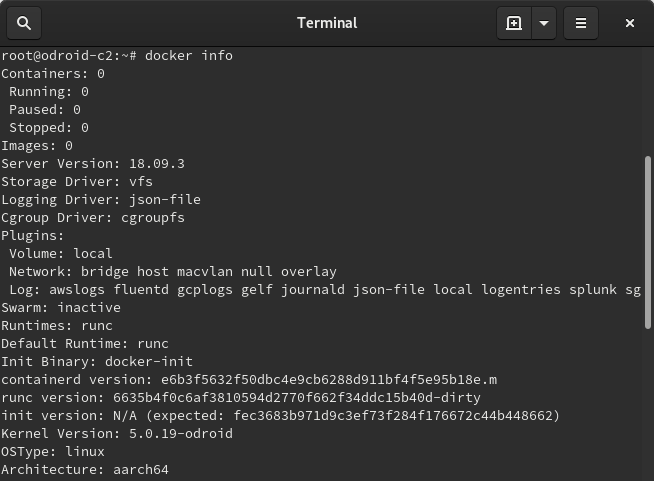

Docker is included in the meta-virtualization package, so we need to add this package to our build, this post will focus on how we get that done and how we modify the kernel configuration to keep docker happy.

```bash
# From the directory where the other meta-... sources are
git clone https://git.yoctoproject.org/git/meta-virtualization

# We need to add the layer to our local configuration
# So from our 'build' dir, run the following
bitbake-layers add-layer ../../meta-virtualization

# We now need to add virtualization features to our distro
#  Not sure if this is needed at the moment, but the meta-virtualization
#  layer recommends it.  It probably adds KVM stuff to the kernel which we
#  don't need, I'll investigate later.
echo 'DISTRO_FEATURES_append = " virtualization"' >> conf/local.conf
# Note, we need bash to run a script later in the post, so I add it here.
echo 'IMAGE_INSTALL_append = " bash docker"' >> conf/local.conf
```

We are not quite done yet, we need to add the layers that the virtualization layer depends upon.  To do this we need to include the meta-openembedded layer, and add specific functionality to our build.

```bash
#Add the meta-openembedded resources in our meta-... directory
git clone git://git.openembedded.org/meta-openembedded

# Then we need to add the specific layers to our projects by
# adding the following to our build/config/bblayers.conf

  /home/matt/projects/yocto/meta-openembedded/meta-oe \
  /home/matt/projects/yocto/meta-openembedded/meta-filesystems \
  /home/matt/projects/yocto/meta-openembedded/meta-networking \
  /home/matt/projects/yocto/meta-openembedded/meta-python \
```

## Updating the kernel configuration ready for docker

Containers rely heavily on the host kernel to operate correctly, this requires you ensure your kernel configuration is set up properly.  Luckily there is a script you can download that is part of the moby project that analyses your current kernel configuration.

```bash
# On device, download an execute the check-config script
wget https://raw.githubusercontent.com/moby/moby/master/contrib/check-config.sh
# Note the script requires bash, which is why we added it to our
# build earlier :¬)
bash check-config.sh

info: reading kernel config from /proc/config.gz ...

Generally Necessary:
- cgroup hierarchy: properly mounted [/sys/fs/cgroup]
- CONFIG_NAMESPACES: enabled
- CONFIG_NET_NS: enabled
- CONFIG_PID_NS: enabled
- CONFIG_IPC_NS: enabled
- CONFIG_UTS_NS: enabled
- CONFIG_CGROUPS: enabled
- CONFIG_CGROUP_CPUACCT: enabled
- CONFIG_CGROUP_DEVICE: enabled
- CONFIG_CGROUP_FREEZER: enabled
- CONFIG_CGROUP_SCHED: enabled
- CONFIG_CPUSETS: enabled
- CONFIG_MEMCG: enabled
- CONFIG_KEYS: enabled
- CONFIG_VETH: missing
- CONFIG_BRIDGE: enabled (as module)
- CONFIG_BRIDGE_NETFILTER: enabled (as module)
- CONFIG_NF_NAT_IPV4: missing
- CONFIG_IP_NF_FILTER: enabled (as module)
- CONFIG_IP_NF_TARGET_MASQUERADE: missing
- CONFIG_NETFILTER_XT_MATCH_ADDRTYPE: enabled (as module)
- CONFIG_NETFILTER_XT_MATCH_CONNTRACK: enabled (as module)
- CONFIG_NETFILTER_XT_MATCH_IPVS: missing
- CONFIG_IP_NF_NAT: missing
- CONFIG_NF_NAT: missing
- CONFIG_NF_NAT_NEEDED: missing
- CONFIG_POSIX_MQUEUE: enabled

Optional Features:
- CONFIG_USER_NS: enabled
- CONFIG_SECCOMP: enabled
- CONFIG_CGROUP_PIDS: enabled
- CONFIG_MEMCG_SWAP: enabled
- CONFIG_MEMCG_SWAP_ENABLED: enabled
    (cgroup swap accounting is currently enabled)
- CONFIG_BLK_CGROUP: enabled
- CONFIG_BLK_DEV_THROTTLING: missing
- CONFIG_IOSCHED_CFQ: missing
- CONFIG_CFQ_GROUP_IOSCHED: missing
- CONFIG_CGROUP_PERF: enabled
- CONFIG_CGROUP_HUGETLB: missing
- CONFIG_NET_CLS_CGROUP: enabled
- CONFIG_CGROUP_NET_PRIO: enabled
- CONFIG_CFS_BANDWIDTH: missing
- CONFIG_FAIR_GROUP_SCHED: enabled
- CONFIG_RT_GROUP_SCHED: enabled
- CONFIG_IP_NF_TARGET_REDIRECT: missing
- CONFIG_IP_VS: missing
- CONFIG_IP_VS_NFCT: missing
- CONFIG_IP_VS_PROTO_TCP: missing
- CONFIG_IP_VS_PROTO_UDP: missing
- CONFIG_IP_VS_RR: missing
- CONFIG_EXT4_FS: enabled
- CONFIG_EXT4_FS_POSIX_ACL: enabled
- CONFIG_EXT4_FS_SECURITY: enabled
- Network Drivers:
  - "overlay":
    - CONFIG_VXLAN: missing
      Optional (for encrypted networks):
      - CONFIG_CRYPTO: enabled
      - CONFIG_CRYPTO_AEAD: enabled
      - CONFIG_CRYPTO_GCM: enabled (as module)
      - CONFIG_CRYPTO_SEQIV: enabled
      - CONFIG_CRYPTO_GHASH: enabled (as module)
      - CONFIG_XFRM: enabled
      - CONFIG_XFRM_USER: enabled (as module)
      - CONFIG_XFRM_ALGO: enabled (as module)
      - CONFIG_INET_ESP: enabled (as module)
      - CONFIG_INET_XFRM_MODE_TRANSPORT: enabled
  - "ipvlan":
    - CONFIG_IPVLAN: missing
  - "macvlan":
    - CONFIG_MACVLAN: missing
    - CONFIG_DUMMY: enabled (as module)
  - "ftp,tftp client in container":
    - CONFIG_NF_NAT_FTP: missing
    - CONFIG_NF_CONNTRACK_FTP: missing
    - CONFIG_NF_NAT_TFTP: missing
    - CONFIG_NF_CONNTRACK_TFTP: missing
- Storage Drivers:
  - "aufs":
    - CONFIG_AUFS_FS: missing
  - "btrfs":
    - CONFIG_BTRFS_FS: enabled
    - CONFIG_BTRFS_FS_POSIX_ACL: enabled
  - "devicemapper":
    - CONFIG_BLK_DEV_DM: enabled
    - CONFIG_DM_THIN_PROVISIONING: missing
  - "overlay":
    - CONFIG_OVERLAY_FS: missing
  - "zfs":
    - /dev/zfs: missing
    - zfs command: missing
    - zpool command: missing

Limits:
- /proc/sys/kernel/keys/root_maxkeys: 1000000

````

So, there is some work to be done on the kernel configuration to make docker happy.  I followed the process in my [earlier post](../yocto-for-odroid-c2) to fixup the kernel to ensure all the required parts were built into the kernel, and not included as a module.  The output of this process can be seen in the [meta-usbbuilder project](https://github.com/m5p3nc3r/meta-usbbuilder).

Build the project again, and put the kernel image onto the SD-card and try again.

## Conclusion



Docker is now installed, but it does not startup automatically.  There are a number of reasons for this

- Docker really likes a properly configured network
- It also likes more entropy in the platforms random number generator
- ...

I will come to fix those issues in my next post.
