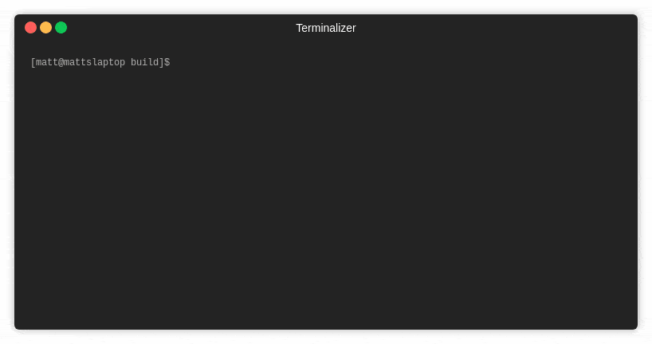

I spent some time analysing the 'Operation not supported' issues from the [previous post](../Native_buildx_on_arm_pt2/), turns out the kernel was having issues with an unsupported syscall.  It's at this point that I realised I should have listened to myself on the first day of this project and mandated use of an upstream kernel.

Never mind!  We live and learn :¬)

So I decided that the next step should be to build my own custom image for the device so that I can control the configuration of the underlying kernel.  For me, there was no question how to do this.  I have been following OpenEmbedded for the longest time now, lived through the tricky days of fragile stability, was present at  Duxford when Intel launched Yocto at ELC in Cambridge and was in part responsible for Arm becoming platinum sponsors of the Yotco project.  So the solution had to be [Yocto](https://www.yoctoproject.org/) based.

Turns out there are some good recipes available for the Amlogic S905 and ODroid C2 platform, I found all the bootstrap information I needed in the [ODroid Magazine](https://magazine.odroid.com/article/yocto-project-running-odroid-c2/)

Rough instructions follow...

````
# Get the poky distro
git clone -b master git://git.yoctoproject.org/poky.git yocto-odroid

# Get the meta packages for odroid targets
git clone -b master git://github.com/akuster/meta-odroid

# move into the poky directory
cd yocto-odroid

# Initialise the build environment
source oe-init-build-env

# Note, we are now in the yocto-odroid/build directory

# Add the meta-odroid package to our configuration
bitbake-layers add-layer ../../meta-odroid

# Set the machine configuration to odroid-c2
echo 'MACHINE = "odroid-c2"' >> conf/local.conf

bitbake core-image-minimal
````

This will take a while to complete, as it is downloading and building all the native packages needed to build the root filesystem for the target system from source.

This just worked for me out-of-the-box.  So, when the build had completed, I could simply burn the image to an sd-card.  You may need to change the target of the following command based on where your sd-card was mounted on the host system.

````
xzcat tmp/deploy/images/odroid-c2/core-image-minimal-odroid-c2.wic.xz | sudo dd of=/dev/mmcblk0 bs=4M iflag=fullblock oflag=direct conv=fsync status=progress
````
Pop the sd-card into the ODroid, power it on, and marvel in your awesomeness as the device boots to a login prompt (username - root, no password.... Who needs security anyway!)


## Configure the kernel for USB Gadget

The next step is to add the USB gadget support so that we can run ethernet over the USB port.

Note - this covers how I created the required kconfig and device tree patches that were needed to get the USB OTG ethernet interface working, you don't need to do these next steps, you can simply [skip to the good part](#this-is-the-good-bit).

````
# Install host dependencies for 'menuconfig'
sudo dnf install ncurses-devel

# If we have already compiled the kernel, we need to clean it
bitbake linux-stable -c kernel_configme -f

# now execute menuconfig (not this poped up in a separate tab, not window)
bitbake linux-stable -c menuconfig

# Add configurations for
#  [*] USB Gadget Support
#    <M> USB Gadget Precomposed configurations
#      <M> Ethernet Gadget
#      <M> Serial Gadget
#      <M> Multifunction Gadget
# I am adding them as modules for now, they will probably want to be baked
# into the kernel in the final product

# We now create the config fragment
bitbake linux-stable -c diffconfig

# Check the console output for where the fragment was dumped
````


## What to do with the config fragment???

This bit gets a little more tricky.  I followed the instructions [here](https://www.yoctoproject.org/docs/1.8/dev-manual/dev-manual.html#understanding-and-creating-layers) and don't want to put a wordy explanation here, so I have put my code up [here](https://github.com/m5p3nc3r/meta-usbbuilder).

## Fiddling with devicetree

To enable the USB OTG mode for the drivers in the kernel, we need to change the runtime configuration of the dwc2 driver in the kernel.  Luckily we don't need to modify the kernel sources to do this, we can simply modify the [device tree](https://www.devicetree.org/) suppled to the kernel at boot time.

Working out what the required changes to get the OTG driver working properly was a bit of a effort, but you can check the resulting changes [here](https://github.com/m5p3nc3r/meta-usbbuilder/blob/master/recipes-kernel/linux/linux-stable/usbgadget.patch).

## This is the good bit

You should be able to add the ```meta-usbbuilder``` outlined above to get you to the point of having a functional ethernet connection

````
# Clone the repository into your project
# In the top level directory of the project (where the other meta-*** projects are)
git clone https://github.com/m5p3nc3r/meta-usbgadget

# Add the overlay to our project cont/bblayers.config
# (left up to the reader to do...)

# Then compile the image again
bitbake core-image-minimal

# Pop onto the SD card and boot the device

````

You should now be able to follow the network configuration in an [earlier post](../Native_buildx_on_arm/#setting-up-the-usb-gadget-ethernet).



## Conclusion

So, hands up... I wanted to release an update every Friday, but getting the kernel configuration working was not the simple an out-of-the-box experience that I was hoping for.  On the original enabling of the 'otg' capability I was faced with a number of FIFO issues.  This added to my being on a business trip last week stalled progress.  But all is fixed now, and I'm back on track.  But I have a working OTG gadget ethernet interface working now, so next post I can hopefully add the [meta-virtualization](https://git.yoctoproject.org/cgit/cgit.cgi/meta-virtualization/) layer to enable docker support.
